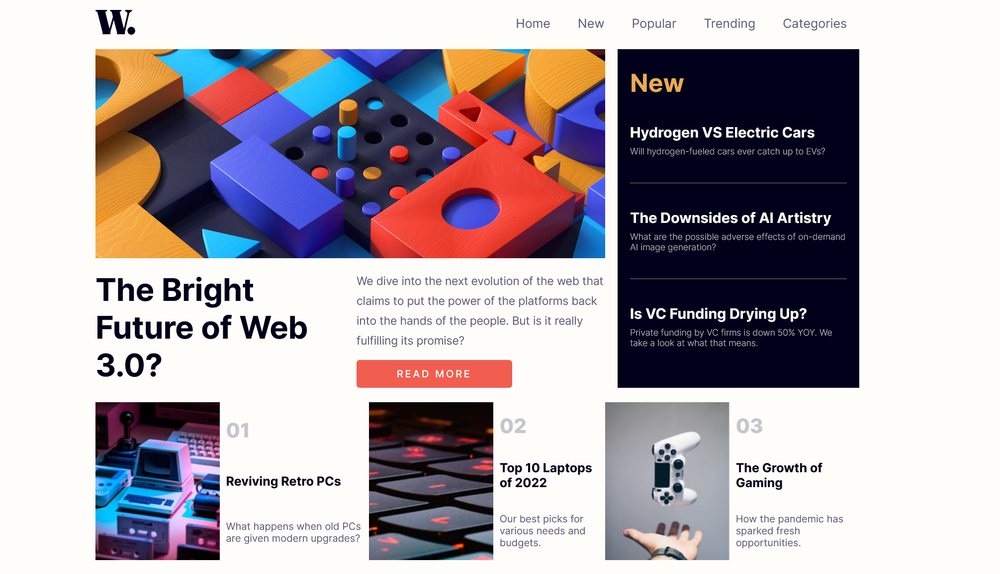

<h1 align="center">News Homepage</h1>
Desafio do Frontend Mentor

## Índice
- [Visão Geral](#visão-geral)
- [Construído com](#construído-com)
- [Meu processo](#meu-processo)
- [Autor](#autor)

## Visão geral
Esta homepage de notícias foi desenvolvida para praticar as minhas habilidades em CSS Grid. 
Haverá muitas decisões difíceis para tomar e muitas oportunidades de aprendizado!

- Design Reponsivo
- Elementos interativos 

## Meu processo
- Criação e estruração do `index.html` 
- Criação da pasta `Css`
    - Estruturação inicial da base visual da aplicação
    - Definição das tags para desktop 
    - Definição das tags para mobile utilizado `media querie`
- Criação das pasta `JS`, e criação e estruração do `main.js`
- Testes para checar o projeto e ajustes finais.

### Construído com 
- HTML5
- CSS3
- JS

### Autor
- LinkedIn - [@tatyanegoncalves](https://www.linkedin.com/in/tatyanegoncalves/)